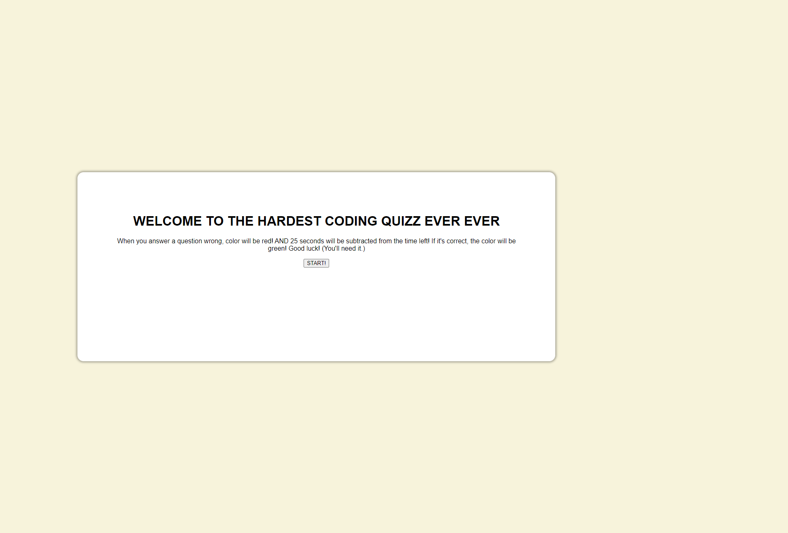

# Coding-Quizz
For this project, a coding quizz was developed. When the user clicks on the
wrong answer, the label will turn red and 25 seconds are subtracted from the timer, if the user clicks on the correct answer, the score will increase by 25.

